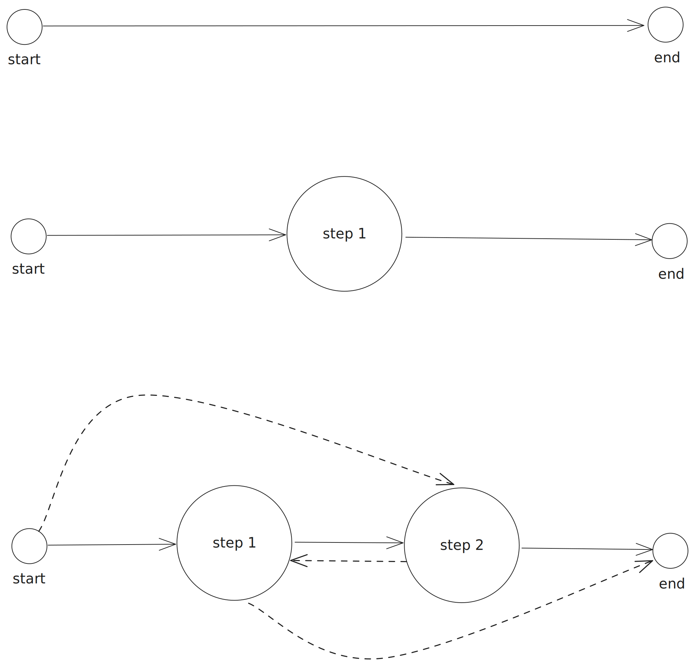

# EBU OGraf

## About

EBU OGraf is a specification for Web-based Broadcast Graphics. 
It allows users to create a Graphic once and use it in multiple compatible Graphic renderers.

## Introduction

A Web-based Graphic is implemented using standardized Web technologies (e.g. HTML, Javascript, CSS, Canvas, Web 
Components, ...) and can be rendered with engines implementing these Web technologies (e.g. browsers or browser engines 
such as Blink and WebKit).

A Web-based Graphics workflow typically consists of the following components (see figure below):
* Editor: an application or service where a user can create and edit Graphics.
* Controller: a user interface or automation layer controlling the playout of the Graphics.
* Server: provides the API endpoints for the controllers and editors. They consist of managing graphics 
  (importing/exporting/listing graphics) and graphics control (i.e. playout of the graphics). The latter is done by 
  sending/receiving commands to/from the Renderer.
* Renderer: is able to render one or more Web-based graphic instances. Based on incoming commands from the Server, a 
  Graphic is animated in, updated or animated out. In order to achieve this, communication between the Renderer and the 
  Graphic is necessary.

Although vendors usually provide all components in one solution, allowing optionally third-party Editors and Controllers 
(typically automation layers), it is certainly possible to see each of the different parts (Editor, Controller, 
Server, and Renderer) coming from different vendors.

The scope of this specification is the format definition of a Graphic and how a Renderer should interpret this format 
in order to render the Graphic. Graphic creators (developers and tools) producing Graphics compatible with this format 
are guaranteed that these Graphics can be rendered in compliant Renderers. This enables more straightforward 
exchanges between different Web-based graphic engine solutions and can support marketplaces for Web-based Graphics.

## Use of Normative Language

The key words "MUST", "MUST NOT", "REQUIRED", "SHALL", "SHALL NOT", "SHOULD", "SHOULD NOT", "RECOMMENDED", "MAY", and "OPTIONAL" in this document are to be interpreted as described in [RFC 2119](https://www.ietf.org/rfc/rfc2119.txt).

## Requirements for a Graphic

A Graphic MUST consist of the following files:
 
- a JSON file containing metadata about the Graphic, referred to as the Manifest file.
  See [Manifest Model](#manifest-model) for more information.
- a Javascript file that exports the Graphic Web Component. The Manifest file MUST contain a reference to this Javascript file. 
  See [Web Component Interface](#web-component-interface) for more information.
- any resources used by the Graphic, such as images, videos, fonts, etc. 
  These resources MAY be organised in a folder structure.

The Manifest file SHOULD be considered as the representation and entrypoint for the Graphic, all other files are either
directly or indirectly referenced from the Manifest file and can be seen as dependencies.

### Manifest Model

The manifest file is a JSON file containing metadata about the Graphic. It consists of the following fields:  

| Field               | Type               | Required | Default | Description                                                                                                                                                                                                              |
|---------------------|--------------------|:--------:|:-------:|--------------------------------------------------------------------------------------------------------------------------------------------------------------------------------------------------------------------------|
| id                  | string             |    X     |         | A unique identifier for the Graphic.                                                                                                                                                                                     |
| version             | integer            |          |    0    | The version of the Graphic. The id-version combination must be globally unique and once a version has been assigned, the Graphic is considered immutable (except when version = 0).                                      |
| name                | string             |    X     |         | The name of the Graphic.                                                                                                                                                                                                 |
| description         | string             |          |         | A longer description of the Graphic.                                                                                                                                                                                     |
| author              | Author             |          |         | An object providing information about the author of the Graphic. When provided, the object MUST contain a `name` field and MAY contain an `email` and `url` field.                                                       |
| main                | string             |    X     |         | Reference to the Javascript file that exports the graphic Web Component.                                                                                                                                                 |
| actions             | Map<string,Action> |          |         | An object with fields corresponding to the ids of custom actions that can be invoked on the Graphic. See below for details about the fields inside an `Action`.                                                          |
| supportsRealTime    | boolean            |    X     |         | Indicates whether the Graphic supports real-time rendering.                                                                                                                                                              |
| supportsNonRealTime | boolean            |    X     |         | Indicates whether the Graphic supports non-real-time rendering. If true, the Graphic MUST implement the non-real-time functions `goToTime()` and `setInvokeActionsSchedule()`.                                           |
| extensibleGraphic   | boolean            |    X     |  false  | Indicates whether the Graphic is a Standard Graphic or an Extensible Graphic. A Standard Graphic MUST support the actions `play`, `update`, `stop` and `step`, while an Extensible Graphic only supports custom actions. |
| schema              | object             |          |         | The JSON schema definition for the payload of the `update` action.                                                                                                                                                       |
| duration            | number             |          |         | Default duration of the Graphic, in seconds. Depending on the context where the Graphic is used, this duration might be accurate or indicative.                                                                          |
| steps               | integer            |          |    1    | The number of steps a Graphic consists of.                                                                                                                                                                               |

#### Real-time vs. non-real-time

Real-time rendering of a Graphic means that the Graphic is animated at real-time speed, typically in the context of live TV.
Non-real-time rendering has no requirement on the speed of rendering, it can be slower or faster than real-time and is 
typically used in post-production scenarios. A Graphic MUST be either marked as real-time, non-real-time or both, 
by means of the `supportsRealTime` and `supportsNonRealTime` fields.

In case of a non-real-time Graphic, there are two additional functions that need to be implemented by the Graphic: 
`goToTime()` and `setInvokeActionsSchedule()` (see [Web Component Interface](#web-component-interface) for their definition). 

#### Standard vs. extensible Graphic

Standard Graphics MUST support the standard actions `play()`, `update()`, `stop()`, and `step()` (see 
[Web Component Interface](#web-component-interface) for their exact definition).
The `play()` action is used to animate the Graphic in, while the `stop()` action will animate the Graphic out. 
The `update()` action is used to update potential data necessary to render the Graphic. The `step()` action is used to 
play the transition to the next step (see [Step model](#step-model)).

An Extensible Graphic has a generic interaction model and is used to support more complex Graphics in terms of operations. 
They are typically used when they rely on complex data-driven use cases and/or multiple parts need to be animated in and out, 
independent of each other. In contrast to Standard Graphics, Extensible Graphics don't need to implement the standard actions 
and solely rely on custom actions defined in the Manifest file. Therefore, the fields `duration` and `steps` in the Manifest 
file are irrelevant in case of Extensible Graphics.

#### Step model

A Standard Graphic MAY contain zero or more steps. A step can be defined as a 'paused' state of the Graphic.
Going from one step to another is done via a transition (with or without animation). The figure below shows three example
step models. Every model has a start and an end node. The start node represents the start of a Graphic rendering, where
typically nothing is visible in the rendered output. Similarly, the end node represents the end of the Graphic rendering,
also typically nothing visible in the rendered output at that moment. The arrows between the nodes represent the transitions.

The first model represents a Standard Graphic containing zero steps. When `play()` is called on this Graphic, it will
animate the Graphic in and after some predefined time the Graphic will animate out automatically.

The second model represents a Standard Graphic containing one step. When `play()` is called on this Graphic, it will 
animate the Graphic in and will pause at step 1. Pausing here doesn't mean that the Graphic is not moving, it refers to 
the fact that there is an interaction necessary with the Graphic to move to the next step (in this case the end).
The `stop()` action SHOULD be used to go to the end of the Graphic.

The third model represents a multi-step Standard Graphic containing two steps. It is similar to the one-step model,
but now the `step()` action MUST be used to transition between different steps, except for the end node, where the `stop()`
action should be used. The normal flow is to go to step 1, then to step 2 and finally to the end node. However, it is 
possible that you transition to any step or directly to the end node (indicated by the dotted lines in the figure).

#### Custom actions

A custom action is an action that is specific for a particular Graphic. It is a mechanism to support any action
a Graphic can execute. The Manifest file defines the custom actions by means of the `actions` field. It represents
a Map where the keys correspond to the id of the custom action and the values are `Action` objects. The `Action` object 
supports the following fields:

| Field       | Type   | Required | Default | Description                                               |
|-------------|--------|:--------:|:-------:|-----------------------------------------------------------|
| label       | string |    X     |         | The name of the action.                                   |
| description | string |          |         | A longer description of the action.                       |
| schema      | object |          |         | The JSON schema definition for the payload of the action. |

#### Vendor-specific fields

Vendor-specific fields are fields in the Manifest that are not part of this specification. Every vendor-specific
field MUST use the prefix `v_`. For example, `v_editor` is a valid vendor-specific field, `editor` is not a valid field. 

### Web Component Interface

A Graphic MUST be implemented in the form of a custom HTML element (i.e. a Web Component). 
The [HTML5 Custom Elements specification](https://html.spec.whatwg.org/multipage/custom-elements.html) defines the 
requirements for such a custom HTML element. 

Therefore, the contents of the `main` Javascript file of a Graphic MUST contain a `class` that extends from `HTMLElement`.
Depending on the rendering capabilities (defined in the Manifest file), a Graphic is expected to implement some functions.

Every Graphic MUST implement the following functions:
* `load()`: Called by the Renderer when the Graphic has been loaded into the DOM. A Promise is returned that resolves
  when everything is loaded by the Graphic.
* `dispose()`: Called by the Renderer to force the Graphic to terminate/dispose/clear any loaded resources. A Promise
  is returned that resolves when the Graphic completed the necessary cleanup.
* `invokeAction({method, payload})`: Called by the Renderer to invoke an Action on the Graphic.
  The `method` field MUST correspond to an id of an Action that is defined in the Manifest file, inside the `actions` field. 
  The schema for the `payload` field is the described in the corresponding Action inside the Manifest file. A Promise
  is returned that resolves when the action is executed.

Additionally, every non-real-time Graphic MUST implement the following functions:
* `gotoTime(timestamp)`: Called to make the Graphic jump to a certain `timestamp`, expressed in milliseconds. A Promise 
  is returned that resolves when the frame is rendered at the requested position.
* `setInvokeActionsSchedule(schedule[])`: Called to schedule actions to be invoked at a certain point in time.
  When this is called, the Graphic is expected to store the scheduled actions and invoke them when the time comes.
  A call to this replaces any previous scheduled actions. The `schedule` argument is a list of objects containing the fields
  `timestamp` (i.e. the time when to perform the action, in milliseconds) and `invokeAction` (i.e. the action to perform at that time).
  The schema for the value of the `invokeAction` field corresponds to the schema of the argument for the `invokeAction` method.  

The default export MUST be used to export the `class` representing the Graphic. 
This type of export allows you to import the Graphic using any name.

TODO: expected actions in case of standard graphic vs add them as explicit methods

## Requirements for a Renderer

The way a Graphic is added into a Renderer is non-normative. 
Different examples are provided [here](TODO) that show how a Graphic can be added to the DOM tree of the Renderer.

However, once a Graphic is added into the Renderer, the following steps MUST be taken:
* call the `load()` function of the Graphic and wait for the promise to resolve
* in case of Standard Graphic, call the `update()` action.

When a Graphic is removed from the Renderer, the following steps MUST be taken:
* call the `dispose()` function of the Graphic and wait for the promise to resolve

## JSON Schema for manifest.json

The normative JSON Schema for manifest.json can be found [here](/definition/definition/json-schema/v1/graphics-manifest/schema.json).

## Typescript interface for graphic.js

The informative Typescript interface for graphic.js can be found [here](/definition/derived/typescript/src/apis/graphicsAPI.ts).

# TBD

* explicit play/stop/step/update functions?
* play vs step
* rendering object?
* duration field definition is (too?) vague
* nr of steps
* version: integer vs semantic versioning?
* custom action -> return schema as well?
