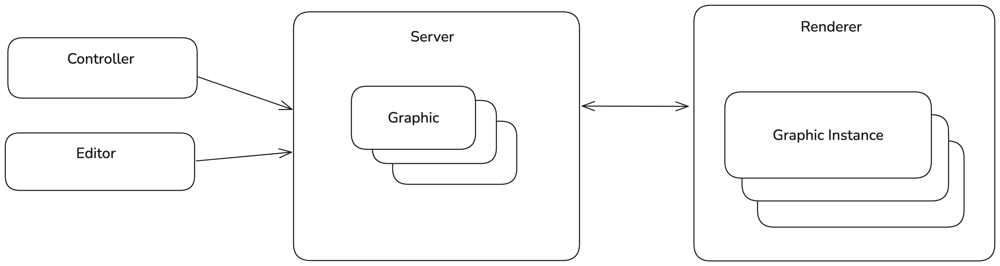

# EBU Web Graphics Definition

## About

EBU Web Graphics is a standardized exchange format for Web-based Graphics. 
It allows users to create a Graphic once and use it in multiple compatible Graphic renderers.

## Introduction

A Web-based Graphic is implemented using standardized Web technologies (e.g. HTML, Javascript, CSS, Canvas, Web 
Components, ...) and can be rendered with engines implementing these Web technologies (e.g. browsers or browser engines 
such as Blink and WebKit).

A Web-based Graphics workflow typically consists of the following components (see figure below):
* Editor: an application or service where a user can create and edit Graphics.
* Controller: a user interface or automation layer controlling the playout of the Graphics.
* Server: provides the API endpoints for the controllers and editors. They consist of managing graphics 
  (importing/exporting/listing graphics) and graphics control (i.e. playout of the graphics). The latter is done by 
  sending/receiving commands to/from the Renderer.
* Renderer: is able to render one or more Web-based graphic instances. Based on incoming commands from the Server, a 
  Graphic is animated in, updated or animated out. In order to achieve this, communication between the Renderer and the 
  Graphic is necessary.

Although vendors usually provide all components in one solution, allowing optionally third-party Editors and Controllers 
(typically automation layers), it is certainly possible to see each of the different parts (Editor, Controller, 
Server, and Renderer) coming from different vendors.

The scope of this specification is the format definition of a Graphic and how a Renderer should interpret this format 
in order to render the Graphic. Graphic creators (developers and tools) producing Graphics compatible with this format 
have the guaranty that these Graphics can be rendered in compliant Renderers. This enables more straightforward 
exchanges between different Web-based graphic engine solutions and can support marketplaces for Web-based Graphics.

## Use of Normative Language

The key words "MUST", "MUST NOT", "REQUIRED", "SHALL", "SHALL NOT", "SHOULD", "SHOULD NOT", "RECOMMENDED", "MAY", and "OPTIONAL" in this document are to be interpreted as described in [RFC 2119](https://www.ietf.org/rfc/rfc2119.txt).

## Requirements for a Graphic

A Graphic MUST consist of the following files:
 
- a JSON file that MUST be named **manifest.json** containing metadata about the Graphic.
  See [Manifest Model](#manifest-model) for more information.
- a Javascript file that exports the graphics Web Component. 
  See [Web Component Interface](#web-component-interface) for more information.
- any resources used by the Graphic, such as images, videos, fonts, etc. 
  These resources MAY be organised in a folder structure.

When exchanged, the files belonging to a Graphic MUST be packaged in a ZIP file.

### Manifest Model

The **manifest.json** file is a JSON file containing metadata about the Graphic. It consists of the following fields:  

* `id` `(string: <required>)`: A unique identifier for the Graphic.
* `version` `(integer: 0)`: The version of the Graphic. The id-version combination must be globally unique and once a version has been assigned, the Graphic is considered immutable (except when version = 0).
* `name` `(string: <required>)`: The name of the Graphic.
* `description` `(string: <optional>)`: A longer description of the Graphic.
* `author` `(object: <optional>)`: An object providing information about the author of the Graphic. The following fields are available:
  * `name` `(string: <required>)`: The name of the author.
  * `email` `(string: <optional>)`: The email address of the author.
  * `url` `(string: <optional>)`: The URL representing the author.
* `main` `(string: graphic.js)`: Reference to the Javascript file that exports the graphic Web Component.
* `actions` `(object: <required>)`: An object with fields corresponding to the ids of actions that can be invoked on the Graphic. Every action is represented by an object containing the following fields:
  * `label` `(string: <required>)`: The name of the action.
  * `description` `(string: <optional>)`: A longer description of the action.
  * `schema` `(object: <required>)`: The JSON schema definition of the action. This is used to validate the action parameters as well as auto-generate a GUI for the action.
* `rendering` `(object: <required>)`: An object providing information about the rendering capabilities of the Graphic. The following fields are available:
  * `supportsRealTime` `(boolean: <required>)`: Indicates if the Graphic supports real-time rendering
  * `supportsNonRealTime` `(boolean: <required>)`: Indicates if the Graphic supports non-real-time rendering. If true, the Graphic MUST implement the 'goToTime()' method.
  * `isStandardGraphic` `(boolean: true)`: Indicates if the Graphic is a Standard Graphic, or an Extensible Graphic. A Standard Graphic MUST support certain Actions, see further.

TODO explain
* standard vs extensible
* how to deal with vendor-specific fields

### Web Component Interface

A Graphic MUST be implemented in the form of a custom HTML element (i.e. a Web Component). 
The [HTML5 Custom Elements specification](https://html.spec.whatwg.org/multipage/custom-elements.html) defines the 
requirements of such a custom HTML element. 

Therefore, the contents of the `main` Javascript file of a Graphic MUST contain a `class` that extends from `HTMLElement`.
Depending on the rendering capabilities (defined in manifest.json), a Graphic is expected to implement some functions.

Every Graphic MUST implement the following functions:
* `load()`: Called by the Renderer when the Graphic has been loaded into the DOM.
* `dispose()`: Called by the Renderer to force the Graphic to terminate/dispose/clear any loaded resources.
* `invokeAction(action)`: Called by the Renderer to invoke an Action on the Graphic. The schema of the Action is described in the manifest.

Every non-realtime Graphic additionally MUST implement the following functions:
* `gotoTime(position)`: Called to make the Graphic jump to a certain point in time.

TODO: how to export the class

## Requirements for a Renderer

TODO: steps a Renderer should take to render a Graphic

## JSON Schema for manifest.json

The normative JSON Schema for manifest.json can be found [here](/definition/definition/json-schema/v1/graphics-manifest/schema.json).

## Typescript interface for graphic.js

The informative Typescript interface for graphic.js can be found [here](/definition/derived/typescript/src/apis/graphicsAPI.ts).

# To be discussed

* renderer target is only relevant when standardizing the Server API
* graphic.mjs vs graphic.js (see https://developer.mozilla.org/en-US/docs/Web/JavaScript/Guide/Modules#aside_%E2%80%94_.mjs_versus_.js)
* default export -> why not name the Javascript class in the Manifest (and keep the JS file fixed)?
* ZIP file requirement
* underscore requirement for vendor-specific properties: really needed?
* authors of a manifest.json are forced to repeat the play/stop/update methods for every Graphic?
  * wouldn't it be better to specify these methods separately?
  * payload of update is still relevant though
* setInvokeActionsSchedule?
